# Arabidopsis Citation 用户手册

**文档版本：v4**

**软件版本：alpha 0.4 (build tfs1097a+)**

## 概述
**在使用软件前，请确保您已经完全阅读了用户手册。**

欢迎使用 Arabidopsis Citation!（下面简称 “Citation”）

Citation 是一款免费、开放源代码的新一代专业科研管理工具，它的功能将包括论文引用管理、任务设置、定时提醒、文件管理、实验记录、仪器管理、数据分析等等。如果您有新的功能建议，欢迎在仓库中发起 Issue，我们会尽力开发您希望添加的功能。

虽然市面上已有部分管理软件，但绝大多数只能做到某一方面的管理。Citation 致力于将零散的科研信息集中化、体系化，辅以AI技术，最大限度地挖掘有用信息。

Citation 是一款不断发展中的软件，如果您在使用中遇到了问题或软件错误，可以发起 Issues 并联系开发者（详见文档末尾的联系方式板块），当然，如果您有能力修复并提交合并请求，我们不胜感激。

这份文档是 Citation 的用户手册，接下来该文档将详细介绍 Citation 中已实装的所有功能的作用和使用方法。在该手册中，带有（**Preview**）标记的内容表示即将更新或暂时不稳定，带有（**Future**）标记的内容表示可能在未来更新。

---

## 项目管理

Citation 中所有的功能模块均以项目为基准，无论是引文、提醒还是其它功能的产生的一切数据都被保存在项目文件（data.accdb）中。

您应该妥善管理自己的项目文件，可以添加项目文件密码，并定期备份项目文件，避免项目文献丢失或泄露造成的损失。

### 新建项目

打开软件，您首先应该做的就是创建一个项目，并保管好项目文件。项目 > 新建 选项卡可以新建一个项目。此时软件将会弹出“项目信息编辑”窗口。在该窗口内填写项目信息，即可创建一个项目。**注意：在编辑项目信息时，不要关闭已经打开的 Arabidopsis Citation 主窗口，否则将导致软件所有窗口均被关闭。**

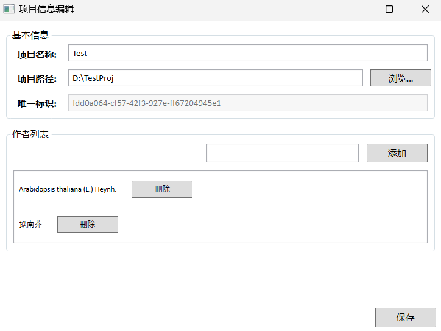

如图所示，在项目名称框内填写项目名称，之后使用“浏览...”按钮选择项目路径。我们建议使用一个空文件夹存放项目，因为之后您的项目可以需要管理许多实验结果、图片、数据等文件。唯一标识将随机生成，无需填写，最后构建作者列表，在“添加”按钮左侧的输入框内输入作者名称即可添加作者。作者支持中英文输入，但是根据国际标准，最好还是使用英文名称。

在点击“保存”按钮后，如果没有异常，该窗口将弹出一个提示框提示项目创建完成，此时主窗口右下角将显示出当前项目的名称。同时，如果您选择了密码保护，则会弹出项目锁定窗口，在“密码授权”一栏验证您的创建密码即可。

### 打开项目

如果您已创建自己的项目或者收到别人发来的项目，请通过“打开项目”功能加载项目。该功能位于 项目 > 打开 选项卡。

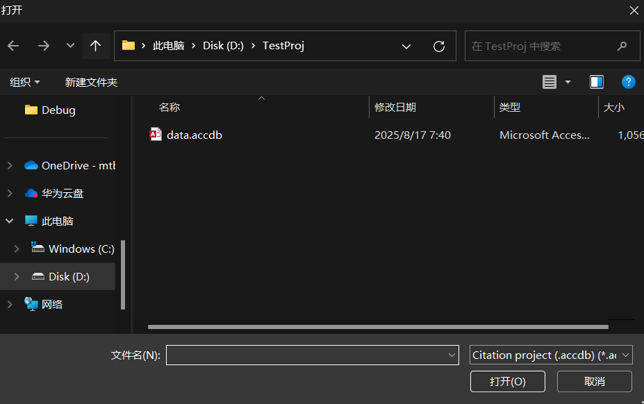

如图，打开项目时要求您选择accdb格式的项目文件，如果收到别人发来的项目压缩包，您可以解压到一个空文件夹中，在选择文件，即可打开项目。

如果项目打开成功，此时主窗口右下角将显示出当前项目的名称。

### 项目锁定

当项目被密码保护时，选择项目文件后会弹出授权窗口，要求使用密码或授权文件解锁项目。

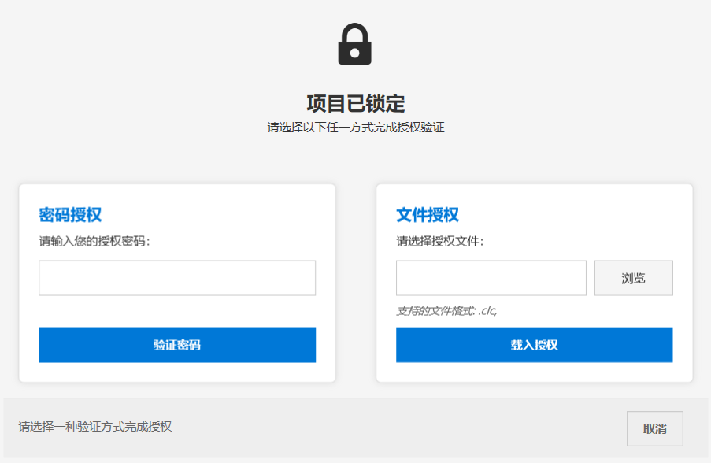

此时可以在两种方式中任选其一，如果您拿到了项目密码，可以直接在“密码授权”一栏中输入密码，点击“验证密码”解锁项目；如果您没有密码，但拥有项目所有者给出的clc授权文件时，可以在“密码授权”一栏中，选择clc授权文件，点击“密码授权”解锁项目。

如果您并不知道授权密码并或输入密码不正确，请不要关闭此窗口强行打开项目，<del>否则可能会看见太奶。</del>

### 关闭项目

当您需要打开新的项目时，请先关闭当前项目。通过 项目 > 关闭 选项卡，您可以关闭当前项目。如果软件回到起始页面，项目名称显示为“尚未打开项目！”则说明项目已经关闭，您可以打开新的项目。

### 备份项目

为了防止项目文件丢失或损坏带来的损失，我们建议您定期备份项目。通过 项目 > 备份 选项卡，您可以选择一个文件夹并备份项目内容，我们不建议把项目备份在项目文件夹里，备份项目时，项目会被自动关闭。此外，您也可以设置定期任务，自动备份项目（**Future**）。

### 分享授权

<span style="color:red"><strong>警告：Citation Security© 不是Citation的标准功能，它仅仅是一个额外的附加功能，用以缓和一部分项目不慎泄露造成的影响。</strong></span>

**免责声明：由于加密功能是是Citation的附加功能，它对于项目加密的能力比较有限，可能会被逆向工程相关专业人员破解。最重要的事情仍然是您需要保管好自己的项目防止泄露。作者不对因项目泄露导致的破解行为承担责任，但您可以依据《中华人民共和国民法典》第一千零三十二条，以及联系作者根据《中华人民共和国刑法》第二百八十五条之规定，最大限度地依法追究破解者的民事和刑事责任。**

当您在新建项目，且密码栏不留空时，项目便会受到密码保护，每次打开项目时，都会弹出项目锁定窗口，要求解锁项目。如果您把项目共享给他人，但不想直接给出密码，或希望对项目加以一定限制，便可以通过项目 > 分享授权 选项卡来创建授权文件。

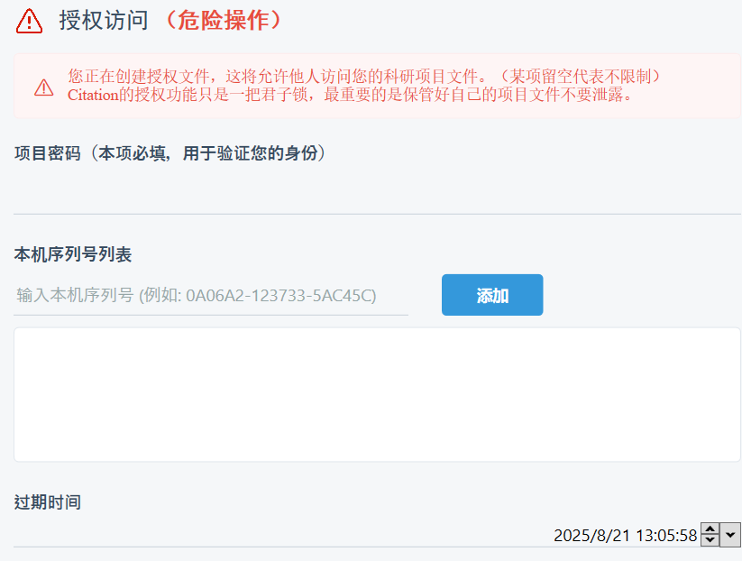

为了验证您的身份，您需要输入项目密码，如果项目密码不正确，创建的授权文件将自动失效。本机序列号和过期时间如果留空，则代表对它们均不作限制。否则可以在本机序列号列表中添加授权的机器序列号（可以通过软件的其它 > 本机序列号中获得本机的唯一序列号）过期时间代表可以打开项目的最晚时间，只要有任意一项不符合，授权将自动失效，可以在一定程度上保护您项目文件的安全。

目前我们推出了两种加密模式，其中 AntiJump 的安全性相对较低，但是如果您不慎丢失了密码，可以联系开发者尽力进行恢复；较新的 CryptoDB 的安全性相对较高，但使用这种模式，我们对您不慎丢失密码的情况无能为力，无论如何请保护好您的项目密码。

虽然我们对本功能做出了警告，但是我们将不断加强该功能的安全防护，尽力为您的数据安全保驾护航。

### 项目设置

对于项目中可以调整的内容，您可以通过项目 > 项目设置 选项卡来打开设置页面。当前版本的项目设置中仅包含论文格式设置，您可以调整项目中论文的引用格式，如APA 7th、MLA 8th、芝加哥格式等。

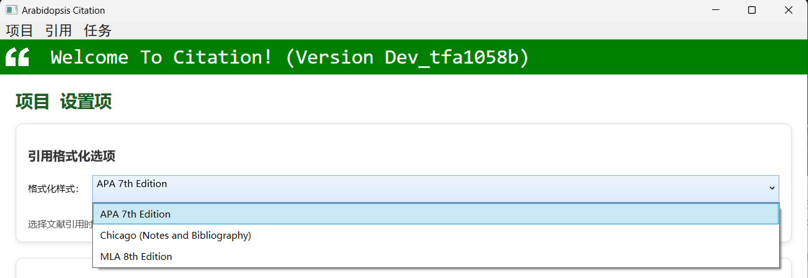

格式在更改后即刻生效，此时查看论文详细信息和导出论文引用中的格式均会与项目设置中的引用格式相匹配。

### 退出软件

项目 > 退出将关闭软件，关闭软件时项目也会被同时关闭。

---

## 引文管理

Citation 中拥有一套完善的文献引用管理机制，可以管理各个子课题下需要引用的文献及其详细信息。

### 添加引用

该功能可以通过文献的doi索引号获取文献的详细信息，只需要将文献的doi粘贴到文本框中，并点击“Cite”按钮，就会自动显示文献相关信息。

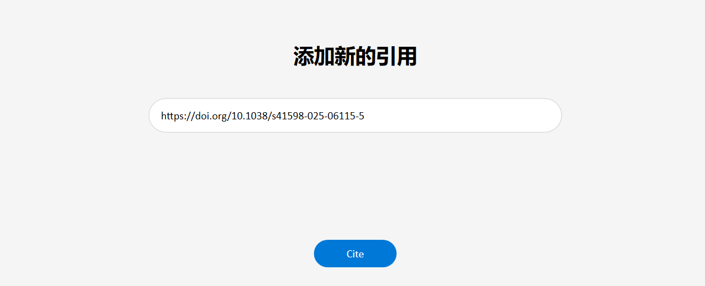

之后可以在切换到的下一个页面内查看并编辑文献的详细信息，如文献标题、作者等。如果某一部分获取到的数据为空，说明文献发布者未显式提供这方面信息，如确有可以手动录入。

保存到的文件夹（子课题）默认为 Default。如果没有子课题需求可以不做修改，否则请修改为子课题名称，这样在查看详细信息时就可以看到子课题了。

点击“添加”按钮，文献就会被添加到项目文献，并自动跳转到“查看引用”页面，否则点击“取消”按钮，文件信息不会予以保存。

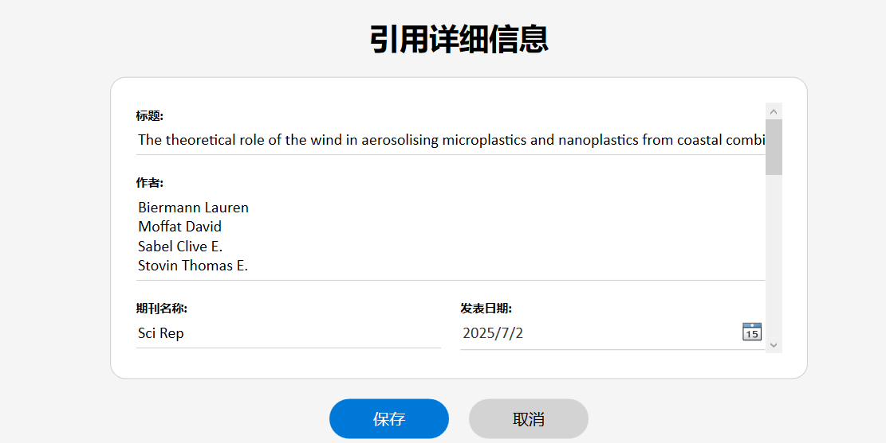

### 查看引用

通过添加引用到数据库或者 引用 > 查看引用 选项卡均可跳转至该页面。左侧的选择框展示了各个子课题（文件夹图标）以及每个子课题下的引文标题。（文章图标）点击文章图标可以跳转到文章的详细信息，在这里可以查看信息，同时也可以生成对于这篇文章的引用，格式在项目设置里定义，文件格式可以通过按钮选择 Markdown 或 LaTeX 格式。

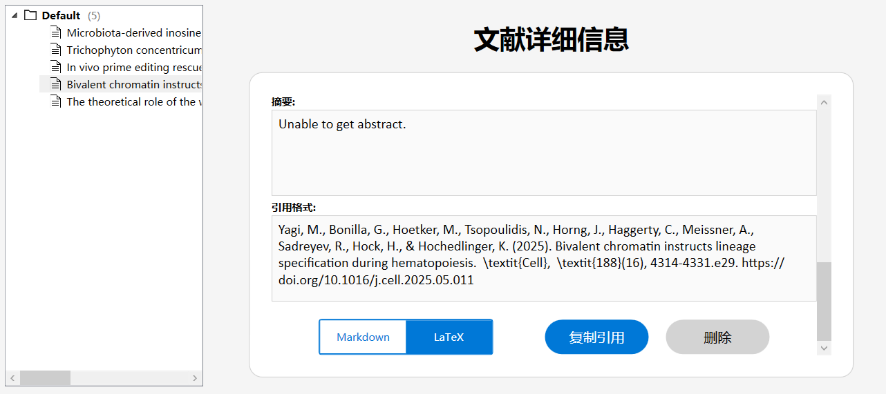

点击“复制引用”即可将引用格式字符串复制到剪贴板，点击“删除引用”即可将引用删除。

### 查看时间线

在用户调研过程中，我们注意到许多用户对将论文按照时间进行整理和分类有较高的需求，为此我们开发了按照论文发表时间排序的时间线功能，通过引用 > 查看时间线 选项卡可跳转至该页面。

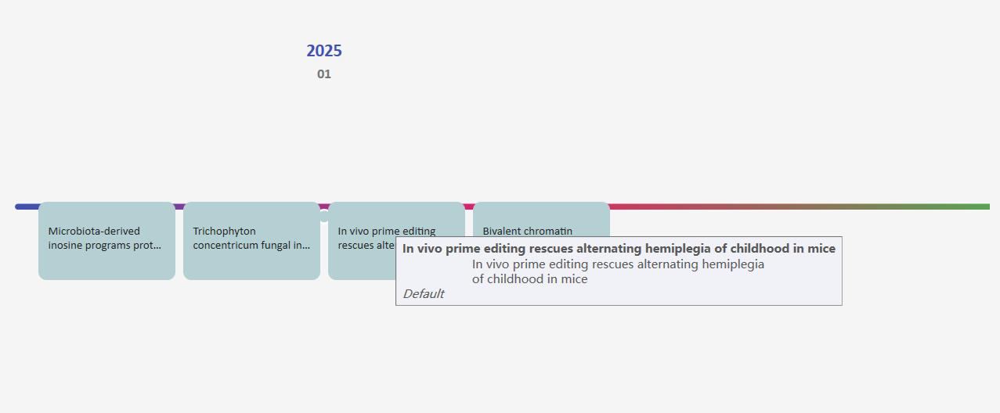

时间线标注了各个论文的发表时间，悬停鼠标可以看到论文的大致信息，点击可以查看论文的详细信息。该功能可以方便您实时追踪研究动向，确定下一步的研究方向。

### 导入引用

Citation 支持从ris格式文件中导入引用，ris格式文件可以在任何出版社以及论文网站中，通过批量引用功能下载。通过“导入引用”功能，您有两种导入选项。一种的通用的ris格式，只需在弹出的对话框中，选择您下载的ris文件，之后保持电脑功率开启，坐和放宽，当弹出“引用导入完成”，说明所有引用导入完毕。当提示“导入失败”时，请根据软件内的相关提示进行排查：
1. 如果导入时，软件提示文件损坏，那么是ris格式文件已经损坏，请您重新下载构建ris文件，之后导入。
2. 如果您未连接互联网，将会导致全部文献导入失败，请确保您已经连接到互联网。
3. 如果导入速度缓慢，且部分或全部不成功，请暂时关闭电脑上运行的vpn或刷新dns缓存后重试。
4. 如果小部分最近的文献导入不成功，说明该文献还没有被正式同步，请您过几天之后重试，或者在单个导入界面中，手动输入论文相关信息。
5. 如果遇到其他问题，请联系作者处理。

另一种是软件专用的cit格式，您需要在导入文献窗口的右下角切换为cit格式，并载入cit文件。导入该格式的文献无需网络，且将在瞬间完成。

导入的文献默认储存在 Default 文件夹中，您可以通过查看引用功能看到它们。

### 导出引用

当所有的工作基本完成，需要导出所有引用格式化文本时，可以通过导出引用功能来完成。您有两种导出选项：一种是导出为格式文件，也就是Markdown和LaTeX格式等易于阅读的格式，另一种是交换文件，可以让他人通过您的交换文件将文献导入到自己的项目中，该过程无需网络。通过引用 > 导出引用 选择卡，软件将自动定位到导出引用页面。该页面包含项目中的所有引用信息，您可以通过上面的筛选菜单，通过课题名称、出版社等条件筛选您需要的论文。拖动论文可以对它们的导出顺序进行排序，点击向下的箭头可以展示论文详细信息。之后点击“导出引用”按钮，即可导出所有论文引用。

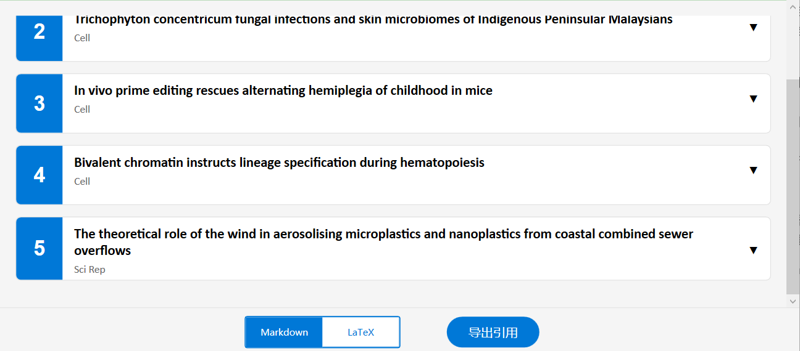

在示例中，导出的内容如下：

> **Reference**

> [1] Stevens, J., Culberson, E., Kinder, J., Ramiriqui, A., Gray, J., Bonfield, M., Shao, T. Y., Al, G., Peterson, L., Steinmeyer, S., Eshleman, E., Negi, S., Zacharias, W., Pryhuber, G., Paul, O., Sengupta, S., Alenghat, T., Way, S., & Deshmukh, H. (2025). Microbiota-derived inosine programs protective CD8+ T cell responses against influenza in newborns. *Cell*, *188*(16), 4239-4256.e19. https://doi.org/10.1016/j.cell.2025.05.013

>[2] Er, Y., Lee, S., Aneke, C., Conlan, S., Muslim, A., Deming, C., Che, Y., Yap, N., Tee, M., Abdull-Majid, N., Shahrizal, S., Leong, K., Han, J., Shen, Z., Than, L., Park, M., Mohd, S., Seyedmousavi, A., Kong, H., Loke, P., Segre, J., & Lim, Y. (2025). Trichophyton concentricum fungal infections and skin microbiomes of Indigenous Peninsular Malaysians. *Cell*, *188*(16), 4257-4274.e13. https://doi.org/10.1016/j.cell.2025.05.034

>[3] Sousa, A., Terrey, M., Sakai, H., Simmons, C., Arystarkhova, E., Morsci, N., Anderson, L., Xie, J., Suri-Payer, F., Laux, L., Roze, E., Forlani, S., Gao, G., Frost, S., Frost, N., Sweadner, K., George, A., Lutz, C., & Liu, D. (2025). In vivo prime editing rescues alternating hemiplegia of childhood in mice. *Cell*, *188*(16), 4275-4294.e23. https://doi.org/10.1016/j.cell.2025.06.038

>[4] Yagi, M., Bonilla, G., Hoetker, M., Tsopoulidis, N., Horng, J., Haggerty, C., Meissner, A., Sadreyev, R., Hock, H., & Hochedlinger, K. (2025). Bivalent chromatin instructs lineage specification during hematopoiesis. *Cell*, *188*(16), 4314-4331.e29. https://doi.org/10.1016/j.cell.2025.05.011

>[5] Biermann, L., Moffat, D., Sabel, C., & Stovin, T. (2025). The theoretical role of the wind in aerosolising microplastics and nanoplastics from coastal combined sewer overflows. *Sci Rep*, *15*(1).  https://doi.org/10.1038/s41598-025-06115-5

---

## 任务管理

在科研工作中，我们需要设立今天需要完成的任务以及定时提醒（比如某物质需要连续抽提1小时，则设置1小时后提醒），为此，Citation 中包含了一整套任务及提醒功能。

### 规划任务

通过规划任务功能，您可以新建一个任务，并标示任务标题与介绍，同时设置任务的起止时间，以及在任务的起止时间是否加以提醒。

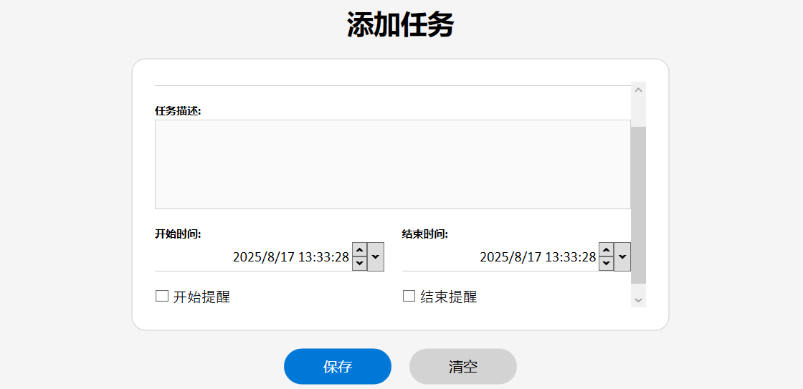

点击“保存”按钮，任务将被保存在项目中，同时提示任务保存成功。点击“清空”按钮，所有数据将均被清空，开始和结束时间被设置为当前时间。

### 查看任务

在查看任务界面，我们可以拖动来查看当天的任务情况，该界面会自动将你定位到当前时间。

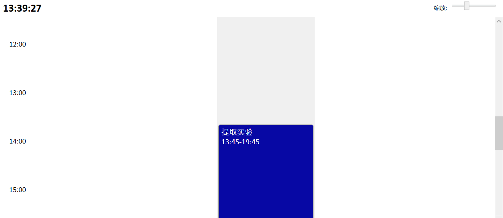

点击表示任务的柱状空间，即可弹出该任务的详情界面，可以对该任务进行编辑或者直接删除，在团队协作中，该界面将通过并行的多列展示每个人的任务情况（**Future**）从而可以方便的安排合作和其他任务。

### 添加提醒

有时候需要提醒的不仅仅是任务，还有其它事情，这是可以通过 任务 > 添加提醒 选项卡来添加提醒。

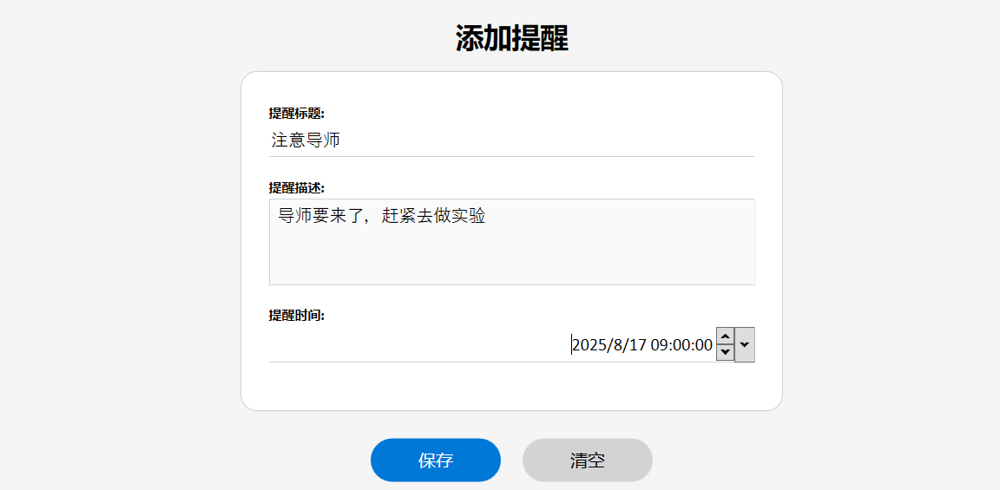

点击保存即可创建单次提醒，同样可以使用“清空”按钮清空输入的信息。

### 设置提醒

当需要修改已经添加的提醒的名称、提醒内容、提醒时间或者删除提醒时，通过任务 > 设置提醒 选项卡可管理相关事宜。

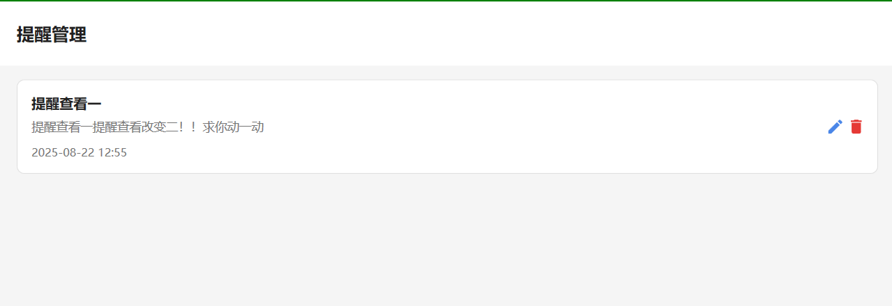

点击列表中任务的编辑按键即可编辑提醒相关信息，点击删除按钮可以删除提醒。（**注意：任务自动产生的提醒为XXX开始了、XXX结束了**）

### 触发提醒

当软件处于打开状态时，一旦到了提醒时间，软件就会弹出提醒窗口，并且自动播放铃声。


点击“确认”按钮可以关闭提醒。

---

## 记录管理

在科研工作中，对于事件的及时记录与处理也非常重要。正因为了解到这些需求，Citation 提供了体系化的记录功能并接入了 Citation Security© ，保证您能够拥有良好的科研体验。

### 便签记录

为提高记录质量，Citation的便签记录提供了富文本RTF格式，通过 记录 > 便签 > 快速新建 选项卡可以新建便签。

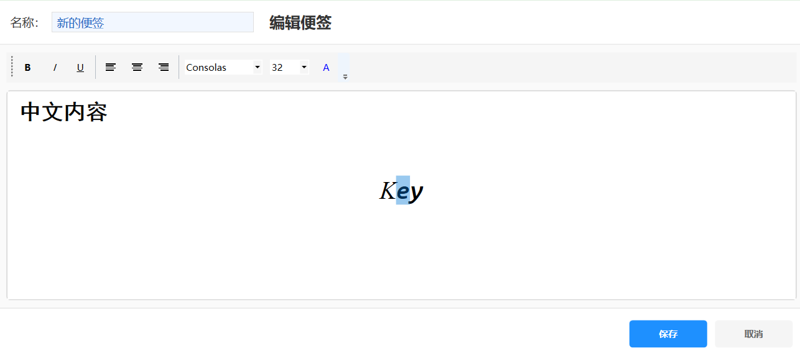

内置编辑器提供了加粗、斜体、下划线、段落对齐、字体、字号等选项，对某一个或一段文字进行格式编辑时，先选中这些文字，在进行格式编辑即可。

点击保存按钮，便签可被保存。通过记录 > 便签 > 查看便签 选项卡可以进入便签编辑界面。点击便签右侧的画笔图标可以进入编辑页面，点击红色的垃圾桶图标可以直接删除便签。

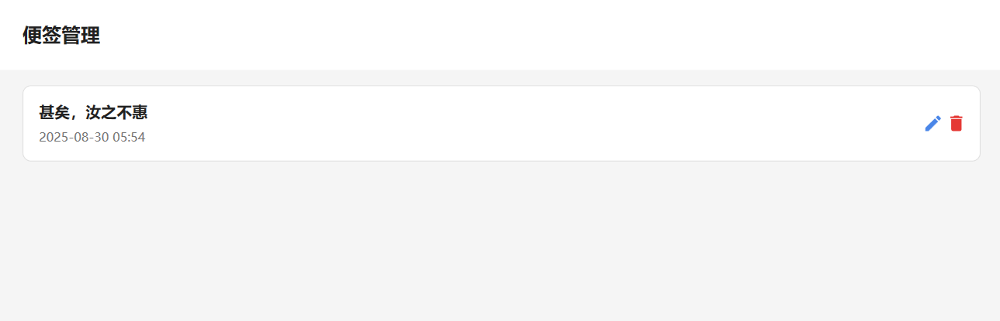

注：当在新建便签处新建便签后直接编辑，则会创建一个新的同名便签，而不是会修改您刚刚创建的便签，修改便签请通过管理页面进入。

### 仪器记录

在进行实验时，我们经常需要关注课题组的仪器资源。为此，Citation 提供了仪器管理功能，在必要时候可以方便的对仪器进行查询或筛选（**Preview**）通过 记录 > 设备 > 添加仪器 选项卡可以记录可用的仪器信息。

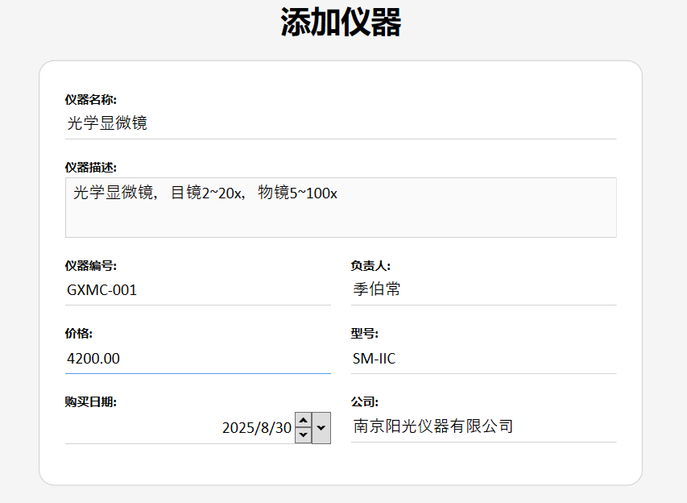

在记录仪器时，您应该添加尽可能详细的信息。仪器编号将作为仪器的唯一索引使用，**切勿在任何情况下使仪器编号重复，即使只是临时编号，否则可能造成无法预料的后果。** 填写完相关信息后，点击“保存”按钮，仪器将被保存到项目文件。

如果仪器记录信息异常需要修改，或希望总览所有仪器，请通过通过 记录 > 设备 > 添加仪器 选项卡打开管理和总览界面。

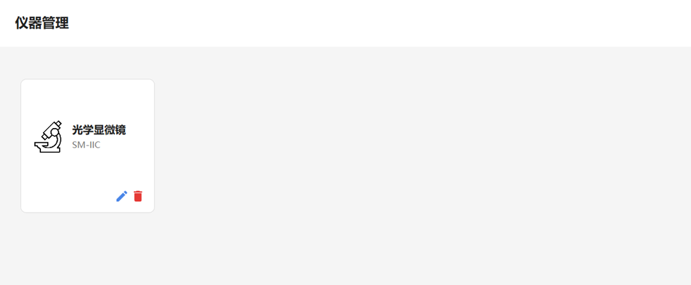

管理界面的操作方式也与之前的大同小异，除了使用了带图片的圆角正方形卡片外，与其余管理界面并无不同，点击画笔按钮修改，点击垃圾桶按钮删除。

### 实验记录

在科研中，最重要的一点便是记录实验流程和结果。Citation 提供了完善的实验记录功能。同时，对于**农学**，我们提供了目前市面上鲜有的**体系化大田实验管理系统**，这也是Citation的一个重要创新点所在。

普通使用记录。（**Preview**）

通过 记录 > 实验 > 大田实验 即可打开大田实验功能，大田实验是专为农学设计的管理系统，为防止设计实验混乱，您必须现将一块试验田完全设置完毕后，才可设置下一块试验田。

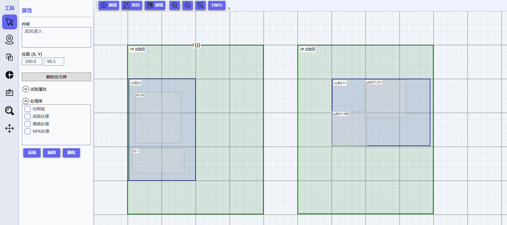

首先，您可以使用左侧工具栏中的绘制田间小区工具（将鼠标悬浮在左侧工具栏上即可查看工具名称）添加试验田，之后通过绘制区组功能对试验田划分区组，最后通过绘制实验小区功能，再将试验田划分为具体的实验小区。

通过左侧的属性窗口可以设置试验田及各区组名称，实验名称及计划、土壤信息等。同时可以通过处理库功能设置对于小区的处理，例如低氮处理、NPK处理等。绘制完毕后，点击“保存”即可保存为文件以供下次使用，也可以直接导出为图片分发使用。

在1100及以上版本，我们引入了AI辅助实验设计功能，只需要向AI说明您需要进行的实验，AI便会给出实验方案以及自动生成的实验图，这个过程可能会消耗几分钟时间，请您稍安勿躁。如果生成的实验不准确，可以再进行自行修改。

如你所见，智慧农业正在迅速兴起。Citation 的大田实验功能将开放API接口，进而能够搭载外部传感器，通过将其与试验田绑定，进而实时查看试验田的各项参数与图表（**Future**）我们将始终与前沿技术接轨，保证您的实验体验。

----
## 智能助手

为了将AI技术全面融入科研管理，Citation 引入了智能助手管理文献和规划科研和实验，让人工智能赋能您的科研创作。

### 相似文献

通过 助手 > 查找可以查找相似论文，在打开项目后，智能助手将会自动读取并装载您的已有论文。配置 Deepseek 秘钥后，点击“查找相似文件”按钮即可自动查找相似文件。查找文献和获取信息过程较为复杂，可能会消耗一分钟左右的时间，请您稍安勿躁。

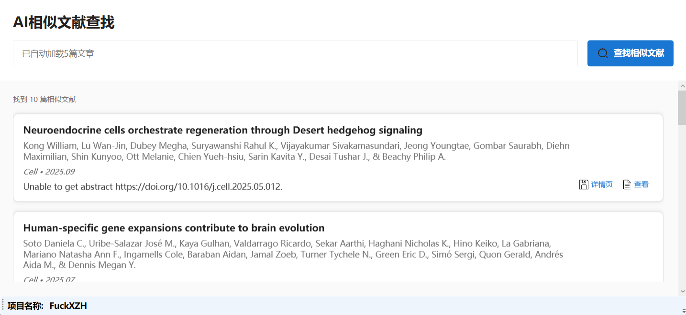

对于查找到的每篇文献，右下角都会出现最多三个按钮。最左边的为查看详情页，此时会打开文献的详情页面，类似于手动引用文献的详细页面，通过右上角的按钮可以返回相似文献页面，通过下方的保存按钮可以将文献添加到您的引用库。第二个为查看大致信息按钮，点击之后会用信息框的形式展示大概信息，如果您对这篇文献有兴趣可以再点击第一个按钮打开详细页面啊。第三个按钮有可能不会出现，当文献为开放权限时，第三个下载按钮便会出现，点击该按钮可以打开或下载该文献的pdf文档。

----

## 其它功能

### 软件设置

在其它 > 软件设置中，您可以调整整个软件的设置项。目前支持设置数据库密码、以及 Citation Security© 的防护模式。在当前版本中，仅支持 AntiJump 与 CryptoDB 模式，数据库密码保持 default 即可。

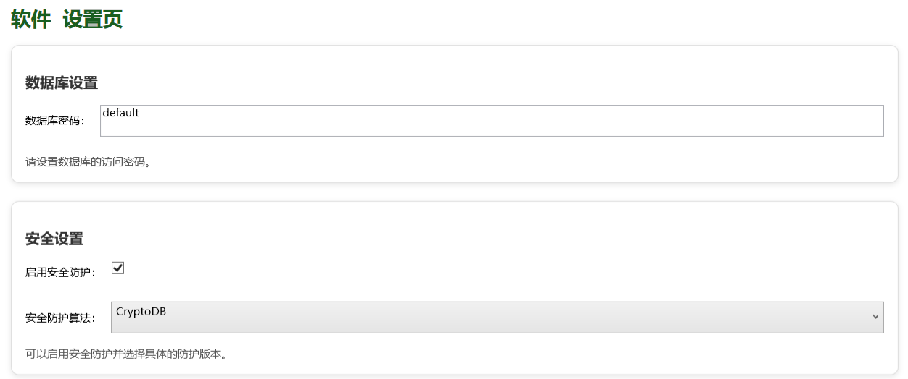

软件设置的信息在根目录下的 `config.xaml` 中亦有记载，手动修改该文件中的信息同样可以修改软件的设置项。

### 本机序列号

通过其它 > 本机序列号选项卡可以生成本机唯一序列号，该序列号可以用于授权功能等。在运行该功能后，软件可能会产生3~5秒钟的轻微卡顿现象，带薪等待即可。计算完成后，您的本机序列号将被自动填充到剪切板。

本机序列号是三组6位数字和字母的组合，例如：

```
0B16A3-812700-4AB45C
```

### 关于我们

通过 其它 > 关于我们选项卡可以定位到在该页面，您可以看到软件的版权信息、开发这联系方式、以及软件版本信息和重要通知等。

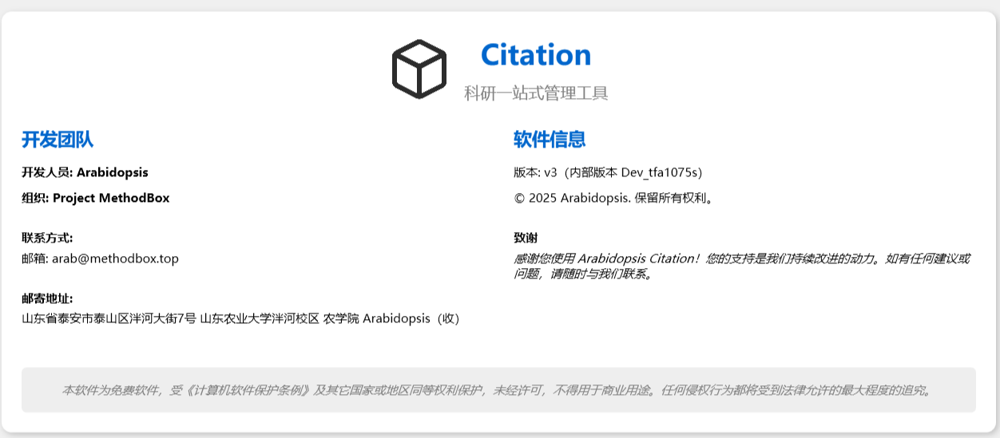

该页面也将展示感谢名单，为我们提出有效建议、指出Bug和不足，或者提交PR贡献都可以登上感谢名单。

**更多功能尚在开发中...**

## 联系我们

用户群：1053379975

邮箱：arab@methodbox.top

来信请寄：山东省泰安市泰山区泮河大街7号山东农业大学泮河校区 农学院 Arabidopsis（收）

---

<div style="text-align: right;">文档编写：Arabidopsis</div>
<div style="text-align: right;">日期：2025.9.11</div>