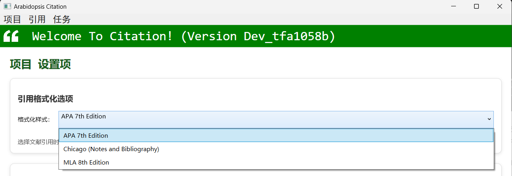
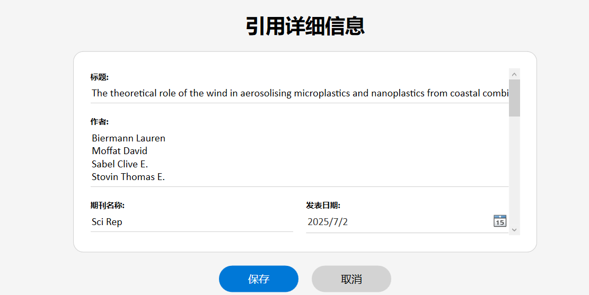
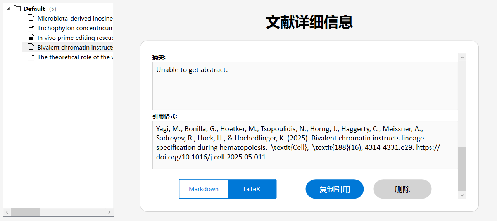
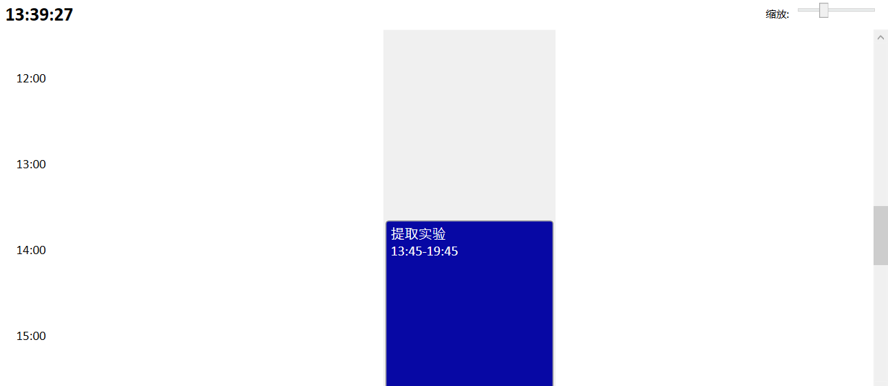
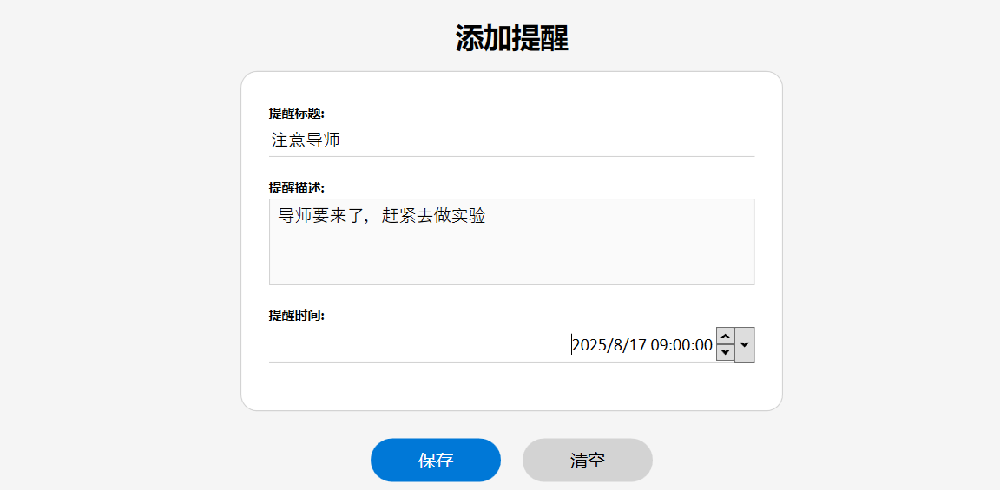
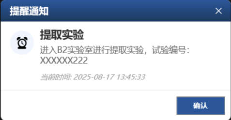

# Arabidopsis Citation User Manual

**Document Version**: v2  
**Software Version**: alpha 0.2 (build tfa1060s)  

## Overview
Welcome to Arabidopsis Citation (hereinafter referred to as "Citation").

Citation is a free, open-source next-generation professional research management tool. Its features will include paper citation management, task setting, timed reminders, file management, experiment records, instrument management, data analysis, etc. If you have suggestions for new features, please submit an Issue in the repository, and we will do our best to develop the features you request.

If you encounter problems or software errors during use, you can submit Issues and contact the developers (see the contact information section at the end of this document). Of course, if you can fix the issue and submit a merge request, we would be very grateful.

This document is the user manual for Citation. The following sections will detail the functions and usage methods of all implemented features. In this manual, content marked with (**Preview**) indicates upcoming updates or temporary instability, while (**Future**) indicates possible future updates.

---

## Project Management

All functional modules in Citation are project-based. All data generated by functions such as citations, reminders, and other features are saved in project files (data.accdb).

You should properly manage your project files. You can add project file passwords (**Preview**) and regularly back up project files (**Preview**) to avoid losses caused by lost or leaked project references.

### Create New Project

When you open the software, the first thing you should do is create a project and store the project file securely. The Project > New tab allows you to create a new project. The software will then pop up the "Project Information Editing" window. Fill in the project information in this window to create a project. **Note: When editing project information, do not close the already opened Arabidopsis Citation main window, as this will cause all software windows to close.**

As shown in the figure, enter the project name in the project name field, then use the "Browse..." button to select the project path. We recommend using an empty folder to store the project, as your project may later need to manage many experimental results, images, data, and other files. The unique identifier will be generated automatically and does not need to be filled in. Finally, build the author list by entering the author name in the input box to the left of the "Add" button. Authors support Chinese and English input, but according to international standards, it is best to use English names.

After clicking the "Save" button, if there are no exceptions, the window will pop up a message box indicating that the project creation is complete. At this time, the name of the current project will be displayed in the lower right corner of the main window.

### Open Project

If you have already created your own project or received a project from someone else, please load the project using the "Open Project" function. This function is located in the Project > Open tab.

As shown in the figure, when opening a project, you will be asked to select a project file in accdb format. If you receive a project package from someone else, you can extract it to an empty folder and then select the file to open the project.

If the project is opened successfully, the name of the current project will be displayed in the lower right corner of the main window.

### Close Project

When you need to open a new project, please close the current project first. Through the Project > Close tab, you can close the current project. If the software returns to the starting page and the project name displays as "No project opened yet!", it means the project has been closed, and you can open a new project.

### Project Settings

For adjustable content in the project, you can open the settings page through the Project > Project Settings tab. The project settings in the current version only include paper format settings. You can adjust the citation format of papers in the project, such as APA 7th, MLA 8th, Chicago format, etc.

Format changes take effect immediately. At this time, the format in the paper details and exported paper citations will match the citation format in the project settings.

### Exit Software

Project > Exit will close the software. The project will also be closed when the software is closed.

---

## Citation Management

Citation has a complete set of literature citation management mechanisms that can manage the literature to be cited and its detailed information under various sub-topics.

### Add Citation

This function can obtain the detailed information of the literature through the doi index number of the literature. Just paste the doi of the literature into the text box and click the "Cite" button, and the relevant information of the literature will be automatically displayed.

You can then view and edit the detailed information of the literature on the next page, such as the title and authors of the literature. If a certain part of the obtained data is empty, it means that the publisher of the literature did not explicitly provide this information. If it is indeed available, it can be entered manually.

The folder (sub-topic) to save to defaults to Default. If there is no sub-topic requirement, you can leave it unchanged. Otherwise, please change it to the name of the sub-topic so that you can see the sub-topic when viewing the details.

Click the "Add" button, and the literature will be added to the project literature and automatically jump to the "View Citation" page. Otherwise, click the "Cancel" button, and the file information will not be saved.

### View Citation

You can jump to this page by adding citations to the database or through the Citation > View Citation tab. The selection box on the left shows each sub-topic (folder icon) and the citation title under each sub-topic (article icon). Clicking on the article icon will jump to the detailed information of the article, where you can view the information and generate citations for this article. The format is defined in the project settings, and the file format can be selected as Markdown or LaTeX format through the button.

Click "Copy Citation" to copy the citation format string to the clipboard. Click "Delete Citation" to move the citation to the recycle bin (**Preview**). Citations in the recycle bin will be automatically deleted after 30 days.

### Import Citation

Citation supports importing citations from ris format files. ris format files can be downloaded from any publisher or paper website through the batch citation function. With the "Import Citation" function, just select the ris file you downloaded in the pop-up dialog box, then keep your computer powered on, sit back and relax. When "Citation import complete" pops up, it means all citations have been imported. When "Import failed" is prompted, please troubleshoot according to the relevant prompts in the software:
1. If the software prompts that the file is damaged during import, the ris format file is already damaged. Please re-download and create the ris file, then import it.
2. If you are not connected to the Internet, all literature imports will fail. Please make sure you are connected to the Internet.
3. If the import speed is slow and some or all are unsuccessful, please temporarily turn off the VPN running on your computer or refresh the DNS cache and try again.
4. If a small number of recent literature imports are unsuccessful, it means that the literature has not been officially synchronized yet. Please try again in a few days, or manually enter the relevant information of the paper in the single import interface.
5. If you encounter other problems, please contact the author for processing.

The imported literature is saved in the Default folder by default, and you can see them through the View Citation function.

### Export Citation

When all the work is basically completed and you need to export all citation formatted text, you can use the export citation function to complete it. Through Citation > Export Citation, the software will automatically locate to the export citation page. This page contains all citation information in the project (**Preview: Filter by sub-topic, title, etc.**). Drag the papers to sort their export order, then click the "Export Citation" button to export all paper citations.

In the example, the exported content is as follows:

> **Reference**
> [1] Stevens, J., Culberson, E., Kinder, J., Ramiriqui, A., Gray, J., Bonfield, M., Shao, T. Y., Al, G., Peterson, L., Steinmeyer, S., Eshleman, E., Negi, S., Zacharias, W., Pryhuber, G., Paul, O., Sengupta, S., Alenghat, T., Way, S., & Deshmukh, H. (2025). Microbiota-derived inosine programs protective CD8+ T cell responses against influenza in newborns. *Cell*, *188*(16), 4239-4256.e19. https://doi.org/10.1016/j.cell.2025.05.013
[2] Er, Y., Lee, S., Aneke, C., Conlan, S., Muslim, A., Deming, C., Che, Y., Yap, N., Tee, M., Abdull-Majid, N., Shahrizal, S., Leong, K., Han, J., Shen, Z., Than, L., Park, M., Mohd, S., Seyedmousavi, A., Kong, H., Loke, P., Segre, J., & Lim, Y. (2025). Trichophyton concentricum fungal infections and skin microbiomes of Indigenous Peninsular Malaysians. *Cell*, *188*(16), 4257-4274.e13. https://doi.org/10.1016/j.cell.2025.05.034
[3] Sousa, A., Terrey, M., Sakai, H., Simmons, C., Arystarkhova, E., Morsci, N., Anderson, L., Xie, J., Suri-Payer, F., Laux, L., Roze, E., Forlani, S., Gao, G., Frost, S., Frost, N., Sweadner, K., George, A., Lutz, C., & Liu, D. (2025). In vivo prime editing rescues alternating hemiplegia of childhood in mice. *Cell*, *188*(16), 4275-4294.e23. https://doi.org/10.1016/j.cell.2025.06.038
[4] Yagi, M., Bonilla, G., Hoetker, M., Tsopoulidis, N., Horng, J., Haggerty, C., Meissner, A., Sadreyev, R., Hock, H., & Hochedlinger, K. (2025). Bivalent chromatin instructs lineage specification during hematopoiesis. *Cell*, *188*(16), 4314-4331.e29. https://doi.org/10.1016/j.cell.2025.05.011
[5] Biermann, L., Moffat, D., Sabel, C., & Stovin, T. (2025). The theoretical role of the wind in aerosolising microplastics and nanoplastics from coastal combined sewer overflows. *Sci Rep*, *15*(1).  https://doi.org/10.1038/s41598-025-06115-5

---

## Tasks and Reminders

In scientific research work, we need to set up tasks to be completed today and timed reminders (for example, if a substance needs to be continuously extracted for 1 hour, set a reminder after 1 hour). For this purpose, Citation contains a complete set of task and reminder functions.

### Plan Tasks

Through the task planning function, you can create a new task, mark the task title and description, and set the start and end time of the task, as well as whether to add reminders at the start and end time of the task.

Click the "Save" button, and the task will be saved in the project, and a message will prompt that the task has been saved successfully. Click the "Clear" button, all data will be cleared, and the start and end time will be set to the current time.

### View Tasks

In the task view interface, we can drag to view the task situation of the day. This interface will automatically locate you to the current time.

Click on the columnar space representing the task to pop up the details interface of the task, where you can edit the task or delete it directly (**Preview**). In team collaboration, this interface will display the task situation of each person through parallel multiple columns (**Future**), so that cooperation and other tasks can be easily arranged.

### Add Reminder

Sometimes what needs to be reminded is not only tasks, but also other things. You can add reminders through the Task > Add Reminder tab.

Click Save to create a one-time reminder. Similarly, you can use the "Clear" button to clear the entered information.

### Trigger Reminder

When the software is open, once the reminder time is reached, the software will pop up a reminder window and automatically play a ringtone.

Click the "Confirm" button to close the reminder.

**More features are under development...**

## Contact Information

User group: 1053379975

Email: arab@methodbox.top

Mailing address: Arabidopsis, College of Agronomy, Shandong Agricultural University (Panhe Campus), 7 Panhe Avenue, Taishan District, Tai'an City, Shandong Province.